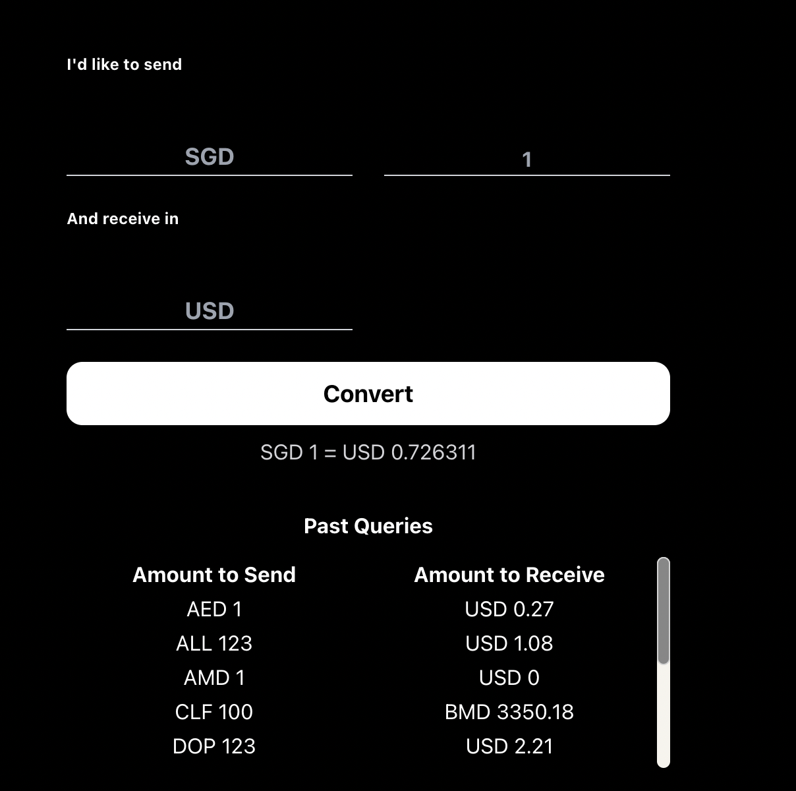

# Currency Conversion Web Application

**Website: [Currency Conversion](https://main.d2chjww20ubos3.amplifyapp.com/)**

This project is built using:

- React.js and Tailwind CSS for frontend
- AWS ecosystem for backend
- exchange rates from [Currency Conversion API](Currencyapi.com)

## How To Use

1. Key in:

   - **amount** and **currency** you would like to send
   - **currency** you would like to exchange for

2. Hit the "Convert" button to get the result and logged into the record of "Past Queries"

